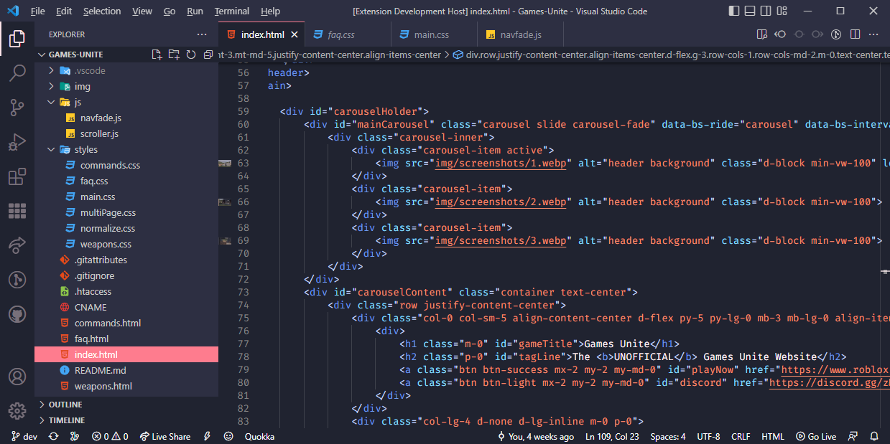

# [Support the original theme creator](https://github.com/ftsamoyed/PinkCatBoo) 

  

# Why was this made?
The bright pastel pink on white statusbar hurt my eyes alongside some html colors that I disagreed with. I decided to edit it for myself and figured others might need the same.  
This version closer matches Dark+ to also make it an easier transition from default VSC dark mode.

## Screenshot
